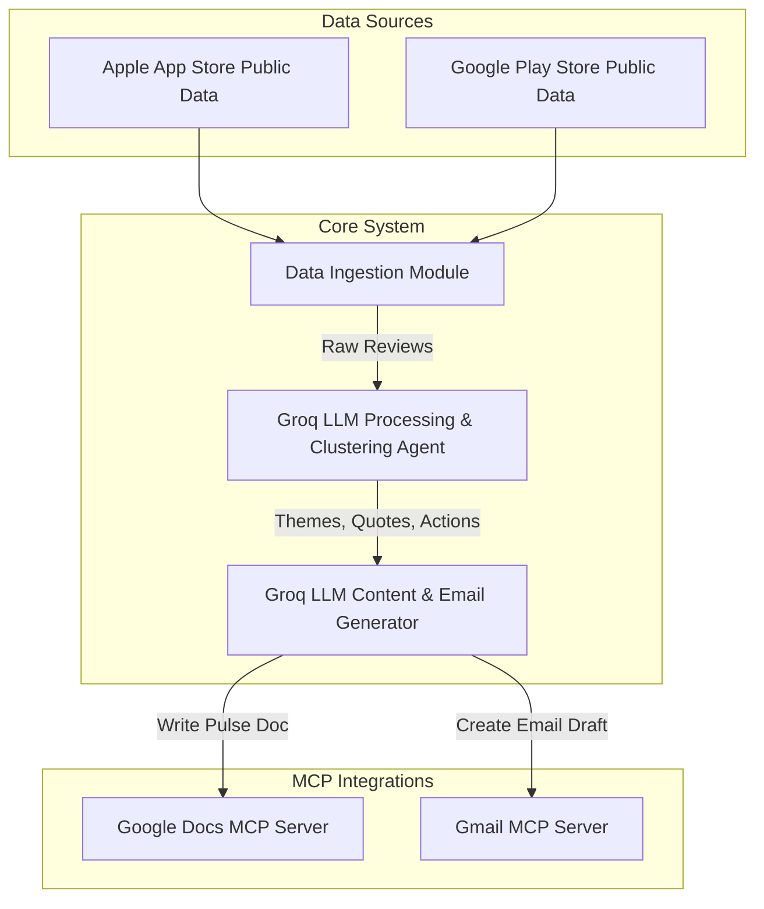

# Architecture: Weekly Mobile-Store Feedback Pulse

This document outlines the system architecture for the automated pipeline that ingests mobile app reviews, processes them using LLMs, and outputs a weekly pulse via Google Docs and Gmail using the Model Context Protocol (MCP).

## 1. High-Level System Architecture

## 2. Component Breakdown

### 2.1 Data Ingestion Module
- **Purpose:** Fetches the last 8-12 weeks of public reviews from the Apple App Store and Google Play Store.
- **Constraints:** Relies solely on public review exports or standard public endpoints. No authenticated scraping that violates Terms of Service.
- **Output:** Aggregated raw JSON/CSV containing rating, title, text, and date.

### 2.2 Groq LLM Processing & Clustering Agent
- **Purpose:** Uses Groq's fast inference to analyze the raw review texts, identify patterns, and extract insights.
- **Key Functions:**
  - **Clustering:** Groups reviews into a maximum of **5 distinct themes** (e.g., onboarding, KYC, payments, UI bugs).
  - **PII Stripping:** Ensures all processed text and user quotes are fully anonymized.
  - **Extraction:** Isolates the **top 3 themes**, selects **3 verbatim real user quotes**, and formulates **3 concrete action ideas**.

### 2.3 Content Generator (via Groq LLM)
- **Purpose:** Uses Groq LLM to compile the insights into a structured, scannable report format and draft the final email copy.
- **Constraints:** The final pulse must be strictly **≤ 250 words**.

### 2.4 MCP Integration Layer
Instead of implementing bespoke OAuth/REST API clients for Google Workspace, the system uses the **Model Context Protocol (MCP)**. This abstracts away direct API management and authentication plumbing.
- **Google Docs MCP Server:** Exposes tools for the agent to create or update the weekly pulse document.
- **Gmail MCP Server:** Exposes tools for the agent to create a draft email addressed to the specified user or alias, containing the pulse or a link to it.

## 3. Data Flow Execution Sequence
1. **Trigger:** A weekly scheduled cron job initiates the workflow.
2. **Fetch:** The Ingestion module pulls the latest batches of public reviews.
3. **Analyze:** The Groq LLM agent processes the reviews, clusters themes, anonymizes data, and extracts the required deliverable components.
4. **Format:** The Content Generator uses Groq LLM to build the final concise report structure and write the final email draft.
5. **Publish to Docs:** The system calls the Google Docs MCP server to write the report and retrieve the document URL.
6. **Draft Email:** The system calls the Gmail MCP server to prepare the draft email with the Groq-generated copy and document URL.

## 4. Security & Compliance
- **Authentication Delegation:** Authentication is handled by the pre-configured MCP servers. The core application logic does not require handling Google OAuth tokens directly.
- **Data Privacy:** Explicit PII filtering ensures no usernames, emails, or device IDs enter the final artifacts.
