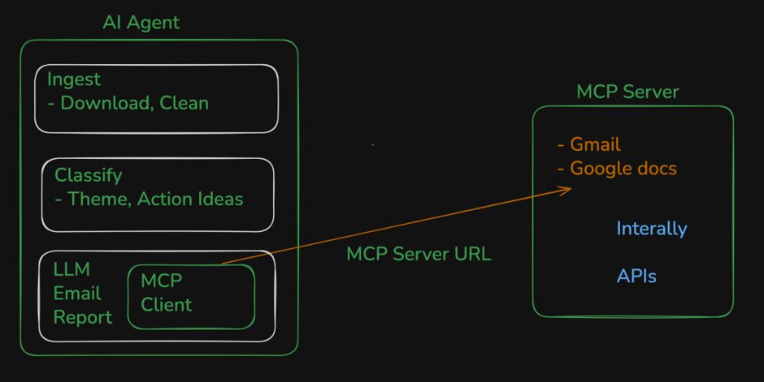

# Context: Weekly Mobile-Store Feedback Pulse

This document outlines the context and requirements for building an automated pipeline to process mobile app reviews into actionable weekly insights.

## 🎯 Goal
Turn raw mobile-store feedback (App Store and Play Store) into a concise, weekly "pulse" document. This helps stakeholders understand user sentiments, read real feedback, and determine next steps without manually sifting through raw reviews.

## 📦 Deliverables
1. **Weekly One-Page Pulse (Google Docs):** A scannable document (≤250 words) highlighting user feedback.
2. **Email Draft (Gmail):** A drafted email sent to yourself (or an alias) containing or linking to the weekly pulse.

## 👥 Target Audience
- **Product / Growth:** To prioritize fixes and improvements based on real user signals.
- **Support:** To align messaging with actual user concerns.
- **Leadership:** To get a quick health check without drowning in data.

## 🏗️ Technical Requirements & Flow
1. **Ingest Data:** Pull public App Store and Play Store reviews from the last 8–12 weeks.
2. **Process & Cluster:** Group reviews into **at most 5 themes** (e.g., onboarding, payments, withdrawals).
3. **Generate Note:** Create the weekly pulse containing:
   - The top 3 themes.
   - 3 real, verbatim user quotes.
   - 3 concrete action ideas based on the themes.
4. **Integration via MCP:** 
   - **Crucial:** Use Model Context Protocol (MCP) servers to interact with Google Docs and Gmail. 
   - Do not write custom OAuth or REST HTTP client code for Google APIs.

## ⚠️ Constraints & Guidelines
- **Data Source:** Only use public review exports. No scraping behind logins or violating Terms of Service.
- **Privacy:** Strictly **no PII** (Personally Identifiable Information). Strip usernames, emails, device IDs, etc. from any quotes or artifacts.
- **Brevity:** Keep the final pulse to 250 words or less.
- **Authenticity:** Use verbatim user quotes—do not invent or paraphrase wording.

- diagram flow -